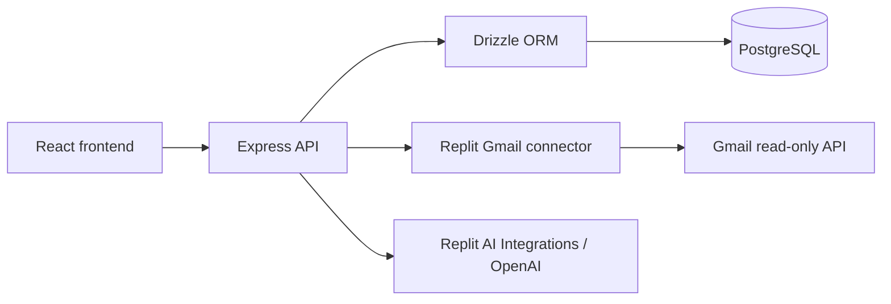

# JobTrack

JobTrack is a job application tracking platform for managing applications and analyzing job-related Gmail messages with AI. It combines persistent application records, dashboard summaries, and an explicit review-and-add workflow for information extracted from email.

**Status: current JobTrack MVP.** The application has no sign-in or per-user data isolation. Gmail and AI email analysis are available only in the development preview.

## Key features

- Create, view, edit, and delete applications.
- Persist application records in PostgreSQL.
- View dashboard totals, status and opportunity-type summaries, and upcoming interviews.
- Search and filter tracked applications.
- Manually search Gmail through a read-only Replit connector.
- Analyze individual email previews with AI and distinguish recruiting/application emails from unrelated messages.
- Review and edit extracted information before explicitly choosing **Add to JobTrack**.
- Ignore email results locally without changing Gmail.
- Prevent duplicate reviewed imports using persistent email provenance and matching application fields.

## Tech stack

| Area | Implementation |
| --- | --- |
| Frontend | React 19, TypeScript, Vite 7, Wouter routing |
| UI | Tailwind CSS 4, Radix UI components, Lucide icons |
| Backend | Node.js, Express 5, TypeScript; esbuild bundling |
| Database | PostgreSQL with the `pg` driver |
| ORM and schema tooling | Drizzle ORM and Drizzle Kit |
| Validation and API contracts | Zod, OpenAPI, Orval-generated types and helpers |
| Gmail | Replit Gmail OAuth connector via `@replit/connectors-sdk` |
| AI | OpenAI SDK through Replit AI Integrations; `gpt-5.4-mini` |
| Development and hosting configuration | pnpm workspace, Replit managed workflows and artifact routing |
| Tests | Node.js built-in test runner; browser-flow verification during development |

## Architecture



The frontend application store calls the existing Applications API. The API validates inputs and uses Drizzle to read and write PostgreSQL. Browser state is a view of those records, not an alternative persistent database.

The email workflow is deliberately separate from saving:

1. **Connect Gmail** verifies the existing workspace OAuth connection.
2. **Check Gmail** retrieves message previews.
3. **Analyze email** sends one selected preview to the backend for AI analysis.
4. The user reviews and edits the result, completing missing required fields.
5. **Add to JobTrack** calls the same application creation API used by manual entry, with a signed review token for duplicate protection.

Neither searching nor analysis creates or updates application records automatically.

### Repository structure

```text
artifacts/
  jobtrack/          React application
  api-server/        Express API, Gmail access, AI analysis, and tests
  mockup-sandbox/    Separate component-preview workspace
lib/
  db/                PostgreSQL connection, Drizzle schemas, migration files
  api-spec/          OpenAPI specification and code generation
  api-zod/           Generated validation schemas
  api-client-react/  Generated API client helpers
scripts/             Workspace utility scripts
```

## Database

**PostgreSQL is the sole source of truth for applications.** Drizzle defines the schema and handles database access. Applications include company, position, opportunity type, work mode, status, dates, interview details, notes, job URL, and source.

Reviewed Gmail imports also store a hashed message identifier linked to an application. Email subjects, snippets, Gmail credentials, and AI responses are not persisted as email records.

Drizzle migration SQL and snapshots live in `lib/db/drizzle/`. The current development schema workflow uses:

```bash
pnpm --filter @workspace/db run push
```

This runs `drizzle-kit push` against `DATABASE_URL`. Review proposed schema changes and use a development database. There is no separate `migrate` package script; SQL migration files are retained in the repository.

## Gmail integration

The server uses the existing Replit-managed Gmail OAuth connection with **`https://www.googleapis.com/auth/gmail.readonly`** permission. Replit handles connector credentials and token refresh.

This is **one workspace-connected mailbox**, not a separate OAuth connection for each visitor. Anyone with access to the development preview can use that connection.

- Gmail routes require `NODE_ENV=development` and reject requests when `REPLIT_DEPLOYMENT=1`.
- The frontend Gmail panel is rendered only in development.
- The default search looks for job-related keywords from the last 180 days, excluding sent messages and drafts.
- Users can supply a custom Gmail search.
- Each check retrieves up to 20 matching previews using `messages.list` followed by metadata reads using `messages.get`.
- Results include sender, subject, date, and snippet. If more matches exist, the UI asks the user to narrow the search.

JobTrack does not send, delete, modify, or mark Gmail messages as read. It does not fetch attachments or full message bodies for this workflow. There are no scheduled checks.

## AI analysis and review

Analysis runs **server-side** using **OpenAI `gpt-5.4-mini` through Replit AI Integrations**. It is manually triggered for each email. The model receives only sender, subject, date, and snippet; the Gmail message ID is excluded from the model input.

The response contains a relevance classification, a short reason, and these nullable fields:

| Field | Meaning |
| --- | --- |
| `companyName` | Employer |
| `position` | Role title; mapped to `positionTitle` when saved |
| `opportunityType` | Supported opportunity category |
| `status` | Supported application stage |
| `applicationDate` | Explicit application date, not automatically the email date |
| `interviewDate` | Unambiguous interview date |
| `interviewType` | Stated interview format/type |
| `interviewLocation` | Stated location or meeting information |
| `interviewNotes` | Short, explicitly supported interview details |
| `jobUrl` | Job URL present in the preview |

The prompt instructs the model to treat email text as untrusted data and leave missing information as `null`. Server validation checks the response structure, enums, dates, and URL safety; a job URL absent from the supplied preview is removed.

AI output can still be incomplete or incorrect, especially because snippets are truncated. The editable review card is the verification step. Required application fields—including work mode, which is not extracted—must be supplied before saving. Unrelated messages are labeled **Not job-related**.

Provider requests use `store: false`. JobTrack does not persist the preview or analysis response; saving persists only the approved application fields and hashed import provenance. This is not a claim about the provider's broader retention policies. Replit AI usage is billed through Replit credits.

## Duplicate prevention

Reviewed imports use the existing `POST /api/applications` endpoint with an `X-JobTrack-Gmail-Review` header:

1. The server verifies an HMAC-signed review token, valid for 24 hours, using `SESSION_SECRET`.
2. A PostgreSQL transaction takes an advisory lock to serialize reviewed imports.
3. It checks the stored SHA-256 message identifier.
4. It also checks existing applications for normalized company + position matches, or an identical nonempty job URL.
5. A match returns the existing application **unchanged** with HTTP 200. Otherwise, it creates the application and its provenance with HTTP 201.

Matching includes manually created applications. Normalization trims and collapses whitespace and ignores case for company and position. It is not semantic or fuzzy matching. Manual application creation does not enforce these import-specific duplicate checks.

This conservative policy may treat a later application to the same company and role as an existing application; intentional repeat applications can be entered manually. Deleting an application cascades to its import provenance, permitting a later re-import.

## API

All routes below are mounted under `/api`.

| Method | Endpoint | Purpose |
| --- | --- | --- |
| GET | `/api/healthz` | Health check |
| GET | `/api/applications` | List applications |
| POST | `/api/applications` | Create an application, or return an existing reviewed import |
| GET | `/api/applications/:id` | Read one application |
| PUT | `/api/applications/:id` | Replace editable application fields |
| DELETE | `/api/applications/:id` | Delete an application |
| POST | `/api/gmail/connect` | Verify the workspace Gmail connection |
| POST | `/api/gmail/search` | Search Gmail using an optional `query` |
| POST | `/api/gmail/analyze` | Classify/extract from a submitted `message` preview |

Gmail routes and reviewed Gmail imports are development-only. Ordinary application CRUD is not authenticated. API contracts are in `lib/api-spec/openapi.yaml`; regenerate helpers after contract changes with:

```bash
pnpm --filter @workspace/api-spec run codegen
```

## Security

- Database credentials, AI credentials, and the review-signing secret are server-side environment variables.
- The browser never receives the AI API key or Gmail OAuth credentials.
- Gmail access remains read-only; review tokens authorize the import workflow, not user identity.
- Gmail and analysis responses use `Cache-Control: no-store`.
- `.gitignore` excludes environment files, common credential/key files, logs, local database backups, and test output. Example environment templates are allowed, so they must contain placeholders only.
- No authentication or ownership checks isolate application records. Keep the preview restricted to trusted users and do not expose sensitive records through an unrestricted deployment.

## Development setup

### Recommended: Replit workspace

The current setup is designed around Replit's managed services and path-based proxy. Use Node.js 24 and pnpm; the project has been verified with pnpm 10.26.1.

1. Import or open the repository in Replit.
2. Configure a development PostgreSQL database and the environment variables below through Secrets/environment configuration.
3. Authorize the Replit Gmail connector and configure Replit AI Integrations for OpenAI if email analysis is needed.
4. Install dependencies, apply the development schema, and typecheck:

   ```bash
   pnpm install --frozen-lockfile
   pnpm --filter @workspace/db run push
   pnpm run typecheck
   ```

5. Start the existing managed workflows:
   - `artifacts/api-server: API Server`
   - `artifacts/jobtrack: web`
6. Open the JobTrack preview. The proxy serves the frontend at `/` and forwards `/api` to Express.

### Environment configuration

| Variable | Used by | Purpose |
| --- | --- | --- |
| `DATABASE_URL` | API / Drizzle | PostgreSQL connection; required for application storage |
| `SESSION_SECRET` | API | Signs Gmail review tokens; use a strong secret |
| `AI_INTEGRATIONS_OPENAI_BASE_URL` | API | Replit-managed OpenAI-compatible endpoint |
| `AI_INTEGRATIONS_OPENAI_API_KEY` | API | Replit-managed AI credential |
| `PORT` | Each service | API: `8080`; JobTrack web: `24923` in current artifact configuration |
| `BASE_PATH` | Vite | `/` for the JobTrack web artifact |
| `NODE_ENV` | API / tooling | Development or production behavior |
| `REPLIT_DEPLOYMENT` | API | Gmail and reviewed imports are blocked when this equals `1` |

The connector SDK relies on Replit-managed runtime identity and authorization. Do not copy Gmail access/refresh tokens into PostgreSQL, source files, or browser configuration.

### Running service commands manually

With the required server environment already supplied, the equivalent development commands are:

```bash
# Terminal 1
PORT=8080 pnpm --filter @workspace/api-server run dev

# Terminal 2
PORT=24923 BASE_PATH=/ pnpm --filter @workspace/jobtrack run dev
```

**Outside Replit:** these commands start separate services, but the repository does not configure a Vite `/api` proxy. Supply a same-origin reverse proxy routing `/api` to port 8080 and `/` to port 24923 before using the frontend. Gmail and Replit AI features additionally require their managed runtime configuration; a plain clone is not a standalone OAuth setup. Server scripts expect variables in the process environment rather than automatically loading a root `.env` file.

Targeted build commands are:

```bash
pnpm --filter @workspace/api-server run build
PORT=24923 BASE_PATH=/ pnpm --filter @workspace/jobtrack run build
```

These commands build artifacts; they do not publish the app. Replit production configuration serves the web build statically and runs the bundled API with `NODE_ENV=production`. Gmail remains disabled there.

## Testing and verification

Run the existing checks:

```bash
pnpm run typecheck

node --test \
  artifacts/api-server/src/lib/gmail-analysis.test.mjs \
  artifacts/api-server/src/routes/gmail.test.mjs \
  artifacts/api-server/src/routes/applications-review.test.mjs
```

The six automated tests cover extraction validation, null handling, invalid/invented URLs, Gmail read-only requests and production blocking, signed-token validation/expiry, concurrent duplicate imports, manual-record matching, and deletion/re-import behavior. The database integration test uses a temporary isolated schema and requires a development `DATABASE_URL` with schema-creation permission; it skips when no database is configured or when running in deployment.

Verification completed during MVP development:

- Full workspace typechecks and all six tests passed.
- The Applications API and live Gmail connection checks succeeded.
- Live AI checks with synthetic emails verified relevance classification, nullable extraction, and signed review tokens without automatically saving applications.
- Browser testing verified review/edit/add, repeated-add duplicate protection, unrelated-message Ignore, failure/retry handling, persisted application details, and a mobile viewport. Synthetic Gmail search results were used for that browser pass; AI and application API calls were live. Temporary test applications were removed.
- The dependency audit reported zero findings after targeted patches to `brace-expansion` 5.0.12 and `fast-uri` 3.1.8. Audit results are a point-in-time check, not a permanent security guarantee.

## Current limitations

- Gmail and AI review are development-preview only and share a workspace mailbox.
- Authentication, per-user ownership, and multi-user isolation are not implemented. Clerk is not part of this MVP.
- Automated routines and background Gmail checks are not implemented.
- AI sees snippets, not full email bodies, and requires human review.
- Search displays up to 20 matches at a time; there is no next-page control.
- Ignore state is local to the current UI session/search, not a persisted mailbox decision.
- Existing applications are not automatically updated from email status changes.

## Possible future improvements

- Add authenticated access and per-user data isolation before broader deployment.
- Design a secure per-user Gmail connection flow.
- Expand search pagination and extraction test coverage.

These are possible next steps, not implemented features.